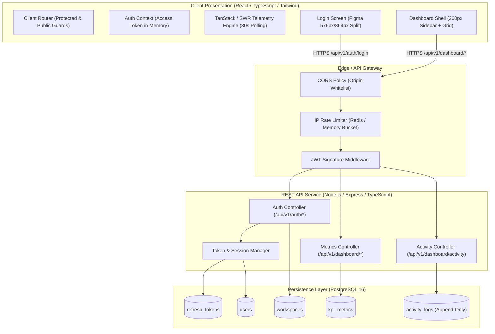

# System Architecture Specification: SaaSflow

**Document Version:** 1.0.0  
**Status:** Approved for Implementation  
**Lead Architect:** Winston (`🏗️`)  
**Design Reference:** Figma File `kQQp6IjO3JC4LjQ6OVIXq9` (`User-DashBoard`)  
**Product Specification:** [_bmad-output/prd.md](file:///C:/Users/ashwi/Desktop/BMAD/Bmad-project/bmad/_bmad-output/prd.md)  
**UX Specification:** [_bmad-output/ux/design.md](file:///C:/Users/ashwi/Desktop/BMAD/Bmad-project/bmad/_bmad-output/ux/design.md) & [_bmad-output/ux/experience.md](file:///C:/Users/ashwi/Desktop/BMAD/Bmad-project/bmad/_bmad-output/ux/experience.md)

---

## 1. Architectural Principles & System Context

Following the "boring technology for stability" doctrine (Dan McKinley) and "developer productivity as architecture":
1. **Clear Decoupling:** Clean separation of concerns between client display logic (SPA / Frontend) and enterprise persistence/authentication rules (REST API / Backend).
2. **Stateless Scale with Stateful Security:** Access tokens remain stateless (JWT in memory) for ultra-fast verification, while refresh tokens remain stateful and revocable in PostgreSQL.
3. **Optimized Query Slices:** Telemetry and activity log endpoints are bound by strict indexing and pagination constraints to ensure predictable sub-100ms response times.

### High-Level System Architecture Diagram



---

## 2. PostgreSQL Relational Database Schema

All database models use strict UUID identifiers, UTC timestamps, and explicit constraints to enforce referential integrity.

```sql
-- Enable UUID extension
CREATE EXTENSION IF NOT EXISTS "uuid-ossp";

-- 1. WORKSPACES TABLE (Multi-tenant context)
CREATE TABLE workspaces (
    id UUID PRIMARY KEY DEFAULT uuid_generate_v4(),
    name VARCHAR(100) NOT NULL,
    slug VARCHAR(100) NOT NULL UNIQUE,
    created_at TIMESTAMPTZ NOT NULL DEFAULT NOW(),
    updated_at TIMESTAMPTZ NOT NULL DEFAULT NOW()
);

-- 2. USERS TABLE
CREATE TABLE users (
    id UUID PRIMARY KEY DEFAULT uuid_generate_v4(),
    workspace_id UUID NOT NULL REFERENCES workspaces(id) ON DELETE CASCADE,
    email VARCHAR(255) NOT NULL UNIQUE,
    password_hash VARCHAR(255) NOT NULL,
    full_name VARCHAR(120) NOT NULL,
    avatar_url TEXT,
    role VARCHAR(50) NOT NULL DEFAULT 'member' CHECK (role IN ('owner', 'admin', 'member', 'auditor')),
    created_at TIMESTAMPTZ NOT NULL DEFAULT NOW(),
    updated_at TIMESTAMPTZ NOT NULL DEFAULT NOW()
);

CREATE INDEX idx_users_email ON users(email);
CREATE INDEX idx_users_workspace ON users(workspace_id);

-- 3. REFRESH TOKENS TABLE (Token Rotation & Revocation)
CREATE TABLE refresh_tokens (
    id UUID PRIMARY KEY DEFAULT uuid_generate_v4(),
    user_id UUID NOT NULL REFERENCES users(id) ON DELETE CASCADE,
    token_hash VARCHAR(255) NOT NULL UNIQUE,
    expires_at TIMESTAMPTZ NOT NULL,
    revoked_at TIMESTAMPTZ,
    user_agent TEXT,
    ip_address VARCHAR(45),
    created_at TIMESTAMPTZ NOT NULL DEFAULT NOW()
);

CREATE INDEX idx_refresh_tokens_user ON refresh_tokens(user_id);
CREATE INDEX idx_refresh_tokens_hash ON refresh_tokens(token_hash);

-- 4. KPI METRICS TABLE (Aggregated operational metrics)
CREATE TABLE kpi_metrics (
    id UUID PRIMARY KEY DEFAULT uuid_generate_v4(),
    workspace_id UUID NOT NULL REFERENCES workspaces(id) ON DELETE CASCADE,
    metric_key VARCHAR(50) NOT NULL CHECK (metric_key IN ('total_revenue', 'active_users', 'conversion_rate', 'avg_response_time')),
    value_numeric NUMERIC(14, 2) NOT NULL,
    value_display VARCHAR(50) NOT NULL,
    delta_percentage NUMERIC(6, 2) NOT NULL,
    delta_direction VARCHAR(10) NOT NULL CHECK (delta_direction IN ('positive', 'negative', 'neutral')),
    timeframe VARCHAR(20) NOT NULL DEFAULT '30d' CHECK (timeframe IN ('7d', '30d', '90d')),
    recorded_at TIMESTAMPTZ NOT NULL DEFAULT NOW()
);

CREATE INDEX idx_kpi_workspace_timeframe ON kpi_metrics(workspace_id, timeframe, recorded_at DESC);

-- 5. ACTIVITY LOGS TABLE (Immutable audit stream)
CREATE TABLE activity_logs (
    id UUID PRIMARY KEY DEFAULT uuid_generate_v4(),
    workspace_id UUID NOT NULL REFERENCES workspaces(id) ON DELETE CASCADE,
    user_id UUID REFERENCES users(id) ON DELETE SET NULL,
    user_name VARCHAR(120) NOT NULL,
    user_email VARCHAR(255) NOT NULL,
    user_avatar TEXT,
    action VARCHAR(255) NOT NULL,
    ip_address VARCHAR(45) NOT NULL,
    status VARCHAR(20) NOT NULL CHECK (status IN ('SUCCESS', 'FAILED', 'PENDING')),
    metadata JSONB DEFAULT '{}'::jsonb,
    created_at TIMESTAMPTZ NOT NULL DEFAULT NOW()
);

CREATE INDEX idx_activity_workspace_created ON activity_logs(workspace_id, created_at DESC);
CREATE INDEX idx_activity_status ON activity_logs(workspace_id, status);
CREATE INDEX idx_activity_search ON activity_logs USING gin (to_tsvector('english', action || ' ' || user_name || ' ' || user_email));
```

---

## 3. REST API Specifications

Base URL Prefix: `/api/v1`

### 3.1 Authentication & Identity Endpoints (`/api/v1/auth/*`)

#### 1. `POST /api/v1/auth/register`
* **Description:** Register a new user and initialize a default workspace.
* **Request Body:**
  ```json
  {
    "email": "alex.d@saasflow.co",
    "password": "supersecurepassword123",
    "fullName": "Alex Devon"
  }
  ```
* **Success Response (`201 Created`):**
  * **Headers:** `Set-Cookie: refreshToken=...; HttpOnly; Secure; SameSite=Lax; Path=/api/v1/auth; Max-Age=604800`
  * **Payload:**
    ```json
    {
      "success": true,
      "accessToken": "eyJhbGciOi...",
      "user": {
        "id": "a9e52c8b-...",
        "email": "alex.d@saasflow.co",
        "fullName": "Alex Devon",
        "role": "owner",
        "workspace": {
          "id": "f47ac10b-...",
          "name": "Vortex Workspace",
          "slug": "vortex-workspace"
        }
      }
    }
    ```

#### 2. `POST /api/v1/auth/login`
* **Description:** Authenticate with email/password and establish access session.
* **Request Body:**
  ```json
  {
    "email": "alex.d@saasflow.co",
    "password": "supersecurepassword123",
    "rememberMe": true
  }
  ```
* **Success Response (`200 OK`):**
  * Same payload & Set-Cookie structure as register.
* **Error Response (`401 Unauthorized`):**
  ```json
  { "success": false, "error": "Invalid email or password" }
  ```
* **Error Response (`429 Too Many Requests`):**
  ```json
  { "success": false, "error": "Too many failed login attempts. Please try again in 15 minutes." }
  ```

#### 3. `POST /api/v1/auth/refresh`
* **Description:** Exchange the `HttpOnly` refresh token cookie for a new short-lived JWT Access Token.
* **Headers:** Cookie: `refreshToken=<token>`
* **Success Response (`200 OK`):**
  * Sets rotated `refreshToken` cookie.
  * Body: `{ "success": true, "accessToken": "eyJhbGci..." }`
* **Error Response (`401 Unauthorized`):**
  * Clears cookie: `Set-Cookie: refreshToken=; Max-Age=0`
  * Body: `{ "success": false, "error": "Session expired or invalid" }`

#### 4. `POST /api/v1/auth/logout`
* **Description:** Revoke the refresh token in PostgreSQL and clear cookie.
* **Success Response (`200 OK`):**
  * Header: `Set-Cookie: refreshToken=; Max-Age=0; Path=/api/v1/auth`
  * Body: `{ "success": true, "message": "Successfully logged out" }`

#### 5. `GET /api/v1/auth/me`
* **Description:** Retrieve currently authenticated profile and workspace context.
* **Headers:** `Authorization: Bearer <accessToken>`
* **Success Response (`200 OK`):**
  * Returns user entity and active workspace.

---

### 3.2 Dashboard & Telemetry Endpoints (`/api/v1/dashboard/*`)

All dashboard endpoints require header: `Authorization: Bearer <accessToken>`.

#### 1. `GET /api/v1/dashboard/metrics?timeframe=30d`
* **Description:** Fetch the 4 core operational KPI ribbon cards.
* **Query Params:** `timeframe` (`7d` | `30d` | `90d`, default `30d`).
* **Success Response (`200 OK`):**
  ```json
  {
    "timeframe": "30d",
    "metrics": [
      {
        "key": "total_revenue",
        "title": "Total Revenue",
        "value": "$48,250",
        "delta": "+12.5%",
        "deltaDirection": "positive",
        "icon": "dollar-sign"
      },
      {
        "key": "active_users",
        "title": "Active Users",
        "value": "2,847",
        "delta": "+8.3%",
        "deltaDirection": "positive",
        "icon": "users"
      },
      {
        "key": "conversion_rate",
        "title": "Conversion Rate",
        "value": "3.24%",
        "delta": "-1.2%",
        "deltaDirection": "negative",
        "icon": "target"
      },
      {
        "key": "avg_response_time",
        "title": "Avg Response Time",
        "value": "245ms",
        "delta": "+4.6%",
        "deltaDirection": "positive",
        "icon": "clock"
      }
    ]
  }
  ```

#### 2. `GET /api/v1/dashboard/charts/engagement?timeframe=30d`
* **Description:** Fetch daily active session counts for area chart visualization.
* **Success Response (`200 OK`):**
  ```json
  {
    "timeframe": "30d",
    "dataPoints": [
      { "date": "2026-09-01", "sessions": 1420 },
      { "date": "2026-09-02", "sessions": 1580 },
      { "date": "2026-09-25", "sessions": 2847 }
    ]
  }
  ```

#### 3. `GET /api/v1/dashboard/charts/traffic`
* **Description:** Fetch channel attribution percentages for donut visualization.
* **Success Response (`200 OK`):**
  ```json
  {
    "totalSessions": "2.8k",
    "channels": [
      { "name": "Direct", "percentage": 40, "color": "#4F46E5" },
      { "name": "Organic", "percentage": 35, "color": "#10B981" },
      { "name": "Referral", "percentage": 15, "color": "#F59E0B" },
      { "name": "Social", "percentage": 10, "color": "#EF4444" }
    ]
  }
  ```

#### 4. `GET /api/v1/dashboard/activity?page=1&limit=4&status=all&search=`
* **Description:** Paginated, filtered query of immutable audit log entries.
* **Query Params:**
  * `page` (integer, default `1`)
  * `limit` (integer, default `4` to match Figma card, max `50`)
  * `status` (`all` | `SUCCESS` | `FAILED` | `PENDING`)
  * `search` (optional string debounced filter)
* **Success Response (`200 OK`):**
  ```json
  {
    "data": [
      {
        "id": "e1a9...",
        "user": {
          "name": "Marcus Aurelius",
          "email": "marcus@rome.net",
          "avatar": "https://..."
        },
        "action": "Upgraded subscription",
        "ipAddress": "192.168.1.45",
        "status": "SUCCESS",
        "timestamp": "2 mins ago",
        "createdAt": "2026-09-25T11:40:00Z"
      },
      {
        "id": "e1b0...",
        "user": {
          "name": "Helena Carter",
          "email": "helena@sky.io",
          "avatar": "https://..."
        },
        "action": "API key generated",
        "ipAddress": "10.0.42.12",
        "status": "SUCCESS",
        "timestamp": "14 mins ago",
        "createdAt": "2026-09-25T11:28:00Z"
      }
    ],
    "pagination": {
      "currentPage": 1,
      "limit": 4,
      "totalRecords": 48,
      "totalPages": 12,
      "hasNextPage": true,
      "hasPrevPage": false
    }
  }
  ```

---

## 4. Architecture Decision Records (ADRs)

### ADR-001: Decoupled Client SPA vs Monolithic SSR
* **Status:** Accepted
* **Context:** We need a responsive dashboard with real-time polling, split-screen login, and Figma fidelity.
* **Decision:** Decouple into a dedicated Vite/React TypeScript SPA front-end and a Node.js Express REST API backend.
* **Consequences:**
  * *Pros:* Clear team ownership, straightforward frontend deployment to static CDNs, zero server-side hydration mismatches for charting components.
  * *Cons:* Requires explicit CORS configuration and client-side route guards.

### ADR-002: Dual-Token (In-Memory JWT + HttpOnly Cookie Refresh) Authentication
* **Status:** Accepted
* **Context:** Storing JWTs in `localStorage` exposes user sessions to XSS token theft. Monolithic cookies can be vulnerable to CSRF.
* **Decision:** Store the short-lived (15 min) JWT Access Token strictly in memory (React Auth Context/State). Store the long-lived Refresh Token in an `HttpOnly`, `SameSite=Lax`, `Secure` cookie with Refresh Token Rotation (RTR).
* **Consequences:**
  * *Pros:* Eliminates XSS token leakage; automated silent token refresh guarantees continuous sessions without user disruption.
  * *Cons:* Page reloads require an immediate `/auth/refresh` call to restore in-memory access token.

### ADR-003: Relational PostgreSQL Schema with JSONB Flexibility
* **Status:** Accepted
* **Context:** Multi-tenant workspace data and audit logs require relational integrity, but audit metadata may vary across actions.
* **Decision:** Use PostgreSQL 16. Enforce foreign keys between `workspaces`, `users`, and `refresh_tokens`. Use `jsonb` column on `activity_logs.metadata` for flexible payload context.
* **Consequences:**
  * *Pros:* Acid compliance, robust indexing on timestamps and tenant IDs, easy migration paths.
  * *Cons:* Requires migration tooling (e.g., Prisma or Drizzle ORM).

### ADR-004: HTTP Polling (30s) with Tab Visibility vs WebSockets
* **Status:** Accepted
* **Context:** PRD Epic 2 mandates real-time metric updates.
* **Decision:** Implement SWR/TanStack Query 30-second interval polling with `document.visibilityState` detection rather than full-duplex WebSockets.
* **Consequences:**
  * *Pros:* Simpler server infrastructure, zero persistent socket connection state to scale, fully cacheable HTTP responses.
  * *Cons:* Metric updates are near-real-time (max 30s delay) rather than instantaneous.

### ADR-005: Strict Design System Mirroring via Tailwind Tokens
* **Status:** Accepted
* **Context:** Figma design defines exact palette (`#4F46E5`, `#0F172A`, `#F8FAFC`), typography scale, and card padding.
* **Decision:** Encode all tokens into `tailwind.config.js` with semantic names (`saasflow.accent`, `saasflow.slate`, etc.) rather than arbitrary inline styles.
* **Consequences:**
  * *Pros:* Enforces pixel parity with Figma; easy design audits.

---

## 5. Implementation Sharding & Story Index

The PRD has been sharded into 6 modular, executable story files in `_bmad-output/stories/`:

| Story ID | File Path | Scope & Focus | Dependency |
| :--- | :--- | :--- | :--- |
| **STORY-01** | [_bmad-output/stories/story-1-auth-backend.md](file:///C:/Users/ashwi/Desktop/BMAD/Bmad-project/bmad/_bmad-output/stories/story-1-auth-backend.md) | PostgreSQL schema, Auth API endpoints, JWT & Refresh Token Rotation | None |
| **STORY-02** | [_bmad-output/stories/story-2-auth-frontend.md](file:///C:/Users/ashwi/Desktop/BMAD/Bmad-project/bmad/_bmad-output/stories/story-2-auth-frontend.md) | Split-screen Figma Login UI, form validation, auth context & guards | STORY-01 |
| **STORY-03** | [_bmad-output/stories/story-3-dashboard-shell.md](file:///C:/Users/ashwi/Desktop/BMAD/Bmad-project/bmad/_bmad-output/stories/story-3-dashboard-shell.md) | 260px Sidebar, Workspace switcher, Header bar, `⌘K` Command Palette | STORY-02 |
| **STORY-04** | [_bmad-output/stories/story-4-kpi-metrics.md](file:///C:/Users/ashwi/Desktop/BMAD/Bmad-project/bmad/_bmad-output/stories/story-4-kpi-metrics.md) | 4 KPI Cards, Skeleton loaders, Delta badges, 30s Polling engine | STORY-03 |
| **STORY-05** | [_bmad-output/stories/story-5-visualizations.md](file:///C:/Users/ashwi/Desktop/BMAD/Bmad-project/bmad/_bmad-output/stories/story-5-visualizations.md) | Engagement Area chart with tabs (`7d/30d/90d`), Traffic Donut chart | STORY-04 |
| **STORY-06** | [_bmad-output/stories/story-6-activity-audit.md](file:///C:/Users/ashwi/Desktop/BMAD/Bmad-project/bmad/_bmad-output/stories/story-6-activity-audit.md) | Paginated Activity log table, Search debounce, Status filtering | STORY-03 |
