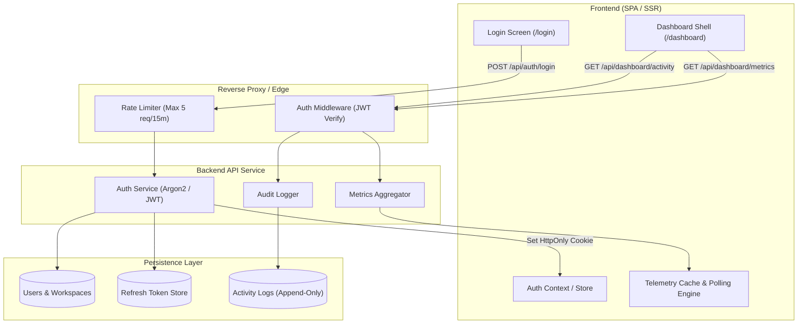

# Product Requirements Document (PRD): SaaSflow Dashboard & Auth System

**Document Version:** 1.0.0  
**Status:** Approved for Implementation  
**Product Manager:** John (`📋`)  
**Design Reference:** Figma File `kQQp6IjO3JC4LjQ6OVIXq9` (File: `User-DashBoard`)  
**Foundational Input:** [_bmad-output/brief.md](file:///C:/Users/ashwi/Desktop/BMAD/Bmad-project/bmad/_bmad-output/brief.md)

---

## 1. Product Vision & Executive Intent

### 1.1 The Strategic Problem ("The Five Whys")
1. *Why do we need a new dashboard?* Workspace admins and product leaders struggle to see holistic operational performance across revenue, users, and infrastructure.
2. *Why is existing tooling inadequate?* Analytics tools (Google Analytics, Mixpanel) don't capture operational events; financial tools (Stripe) omit infrastructure latency; server logs (Datadog) lack business context.
3. *Why can't teams use separated dashboards?* Context-switching wastes executive time and introduces security blind spots when tracing anomalies (e.g., correlating a revenue drop with failed payments or latency spikes).
4. *Why is authentication the foundational epic?* SaaS operational dashboards contain sensitive financial and security telemetry. Without hardened token lifecycle management, data isolation, and route guards, the platform risks multi-tenant leakage.
5. *Why build now?* Launching SaaSflow's unified workspace with a tight, validated MVP allows immediate pilot customer onboarding with enterprise-grade confidence.

### 1.2 Product Objectives & Core Hypotheses
* **Hypothesis 1:** Providing an instant-glance KPI ribbon (< 100ms response) backed by near-real-time polling will increase daily executive engagement by 40%.
* **Hypothesis 2:** Unifying security audit logs with financial telemetry allows operations teams to identify and resolve failed transaction anomalies 3x faster than searching decoupled server logs.
* **Success Criteria (OKRs):**
  * **Objective 1:** Sub-second auth and dashboard time-to-glass (FCP < 600ms, LCP < 1.2s).
  * **Objective 2:** Zero authentication regressions; 100% test coverage for token refresh and protected route guards.
  * **Objective 3:** 100% visual and interactive fidelity with verified Figma specifications (`#4F46E5` Indigo palette, Inter typography, exact layout proportions).

---

## 2. User Personas & Critical User Journeys

| Persona | Role | Key Goal | Core Friction to Eliminate |
| :--- | :--- | :--- | :--- |
| **Alex Devon** | Workspace Owner & Founder | Monitor platform growth (MRR, Users) and manage workspace sessions seamlessly. | Unreliable session timeouts; slow-loading dashboards. |
| **Sarah Jenkins** | VP of Product & Growth | Analyze customer conversion trends and traffic attribution across time horizons. | Disconnected analytics; inability to toggle timeframes effortlessly. |
| **Marcus Aurelius** | SecOps & Infrastructure Lead | Detect payment failures, monitor API token generation, and audit IP access patterns. | Lagging or un-paginated log dumps; untracked client IPs. |

---

## 3. Epic Breakdown & Detailed Specifications

---

### Epic 1: Authentication & Identity Management

**Goal:** Provide secure, robust, full-stack user authentication using JWT access and refresh token rotation, strict cookie policies, route guards, and an exact Figma-matched UI.

#### User Stories & Acceptance Criteria

##### Story 1.1: User Login & Session Initiation
* **As a** workspace user (e.g., Alex Devon),
* **I want to** authenticate using my email and password with an optional "Remember me" setting,
* **So that** I can securely access my workspace dashboard.
* **Acceptance Criteria:**
  * **AC 1.1.1 (Validation):** Form validates email format and requires password before submit. Shows red warning border (`#EF4444`) on error.
  * **AC 1.1.2 (Password Visibility):** Clicking the `eye-off` icon toggles the password input between masked (`type="password"`) and plaintext (`type="text"`).
  * **AC 1.1.3 (Credentials Check):** `POST /api/auth/login` verifies bcrypt-hashed credentials. On failure, responds with `401 Unauthorized` with generic message *"Invalid email or password"*.
  * **AC 1.1.4 (Brute Force Lock):** More than 5 consecutive failed attempts from the same IP lock out the endpoint for 15 minutes (`429 Too Many Requests`).
  * **AC 1.1.5 (Session Tokens):** Successful login issues:
    1. Short-lived Access Token (JWT, 15 min lifespan) returned in response payload or memory.
    2. Long-lived Refresh Token (7 days if "Remember me" is checked, 24 hours if unchecked) issued as an `HttpOnly`, `SameSite=Lax`, `Secure` cookie.
  * **AC 1.1.6 (Navigation):** On success, user is smoothly routed to `/dashboard`.

##### Story 1.2: User Registration & Workspace Seeding
* **As a** new customer,
* **I want to** create a new SaaSflow account,
* **So that** a personal tenant workspace is automatically initialized for me.
* **Acceptance Criteria:**
  * **AC 1.2.1:** `POST /api/auth/register` accepts `name`, `email`, `password`.
  * **AC 1.2.2:** Password must meet complexity policy (minimum 8 characters, at least 1 number and 1 special character).
  * **AC 1.2.3:** System creates user record and provisions default workspace (`Vortex Workspace`).
  * **AC 1.2.4:** Returns active session tokens and redirects directly to `/dashboard`.

##### Story 1.3: Silent Token Refresh & Session Continuity
* **As an** active user working in the dashboard,
* **I want** my session to automatically refresh without interrupting my workflow,
* **So that** I don't get abruptly logged out during active tasks.
* **Acceptance Criteria:**
  * **AC 1.3.1:** Front-end interceptor catches `401 Unauthorized` API responses or initiates refresh 1 minute before access token expiry.
  * **AC 1.3.2:** `POST /api/auth/refresh` reads the `HttpOnly` refresh token cookie. If valid, issues a fresh Access Token and rotates the Refresh Token (Refresh Token Rotation - RTR).
  * **AC 1.3.3:** If the refresh token is expired or revoked, user is redirected to `/login?session_expired=true` and notified.

##### Story 1.4: Session Termination (Logout)
* **As an** authenticated user,
* **I want to** click "Log out" in the sidebar profile card,
* **So that** my credentials and tokens are invalidated across both client and server.
* **Acceptance Criteria:**
  * **AC 1.4.1:** Clicking logout triggers `POST /api/auth/logout`.
  * **AC 1.4.2:** Server marks refresh token revoked/blacklisted and sets `Max-Age=0` on the cookie.
  * **AC 1.4.3:** Client clears in-memory state and redirects user to `/login`.

##### Story 1.5: Protected Route Guards
* **As a** system administrator,
* **I want** unauthenticated visitors blocked from accessing `/dashboard/*`,
* **So that** proprietary metrics are strictly guarded.
* **Acceptance Criteria:**
  * **AC 1.5.1:** Client router middleware checks auth state. If unauthenticated, redirects to `/login?next={target_url}`.
  * **AC 1.5.2:** Server middleware verifies JWT signature on all `/api/dashboard/*` endpoints; returns `401` immediately if missing or invalid.

---

### Epic 2: Real-time Metric Analytics & Visualization

**Goal:** Deliver responsive, high-performance operational metrics and interactive chart visualizations matching Figma layout, equipped with robust loading, error, and auto-polling states.

#### User Stories & Acceptance Criteria

##### Story 2.1: Operational KPI Ribbon
* **As a** workspace executive,
* **I want to** see 4 core metric cards (Total Revenue, Active Users, Conversion Rate, Avg Response Time) with deltas,
* **So that** I instantly understand the platform's financial and technical health.
* **Acceptance Criteria:**
  * **AC 2.1.1 (Card Layout):** 4 responsive cards styled in pure white `#FFFFFF`, border `#E2E8F0`, rounded corners (12px), subtle shadow `0px 4px 12px rgba(0,0,0,0.05)`.
  * **AC 2.1.2 (Metric Definitions):**
    1. **Total Revenue:** Displays currency value (e.g., `$48,250`) + Delta badge (`+12.5%` in emerald `#10B981` on `#D1FAE5`).
    2. **Active Users:** Displays integer value (e.g., `2,847`) + Delta badge (`+8.3%` in emerald).
    3. **Conversion Rate:** Displays percentage (e.g., `3.24%`) + Negative Delta badge (`-1.2%` in rose `#EF4444` on `#FEE2E2`).
    4. **Avg Response Time:** Displays millisecond latency (e.g., `245ms`) + Delta badge (`+4.6%` in emerald).
  * **AC 2.1.3 (Icons):** Each card includes its respective icon inside a `#EEF2FF` light-indigo container (`dollar-sign`, `users`, `target`, `clock`).

##### Story 2.2: Metric States (Loading, Error, Stale)
* **As an** end user on variable network connections,
* **I want** visual feedback when metrics are loading or when an error occurs,
* **So that** I never see broken or deceptive data.
* **Acceptance Criteria:**
  * **AC 2.2.1 (Loading State):** Displays pulse shimmer skeleton placeholders matching exact card dimensions before data arrives.
  * **AC 2.2.2 (Error State):** If API fails, card displays an alert state with a *"Retry"* action button; does not crash the page.
  * **AC 2.2.3 (Stale / Updating):** When polling in the background, existing numbers remain visible without screen flicker.

##### Story 2.3: Configurable Background Polling
* **As a** dashboard user,
* **I want** metrics to automatically update in the background,
* **So that** I always see fresh operational numbers without manual page refreshes.
* **Acceptance Criteria:**
  * **AC 2.3.1:** Front-end employs polling query (interval: 30 seconds default, configurable).
  * **AC 2.3.2:** Polling pauses when the browser tab is hidden/minimized to preserve client battery and server resources (`document.visibilityState === 'hidden'`).
  * **AC 2.3.3:** Header date filter dropdown (`Last 30 Days`, `7d`, `90d`) updates the query timeframe and triggers an immediate refresh.

##### Story 2.4: Data Visualizations (Engagement Trends & Traffic Donut)
* **As a** growth manager,
* **I want to** inspect user engagement trends over time and traffic channel attributions,
* **So that** I know which acquisition routes are yielding active users.
* **Acceptance Criteria:**
  * **AC 2.4.1 (Engagement Area Chart):**
    * Renders daily active session volume.
    * Offers interactive timeframe switcher tabs: `7d`, `30d` (active by default), `90d`.
    * Smooth area gradient fill in `#4F46E5` with `#0F172A` tooltip values on hover.
  * **AC 2.4.2 (Traffic Donut Chart):**
    * Multi-segment radial donut breakdown: Direct (40%, `#4F46E5`), Organic (35%, `#10B981`), Referral (15%, `#F59E0B`), Social (10%, `#EF4444`).
    * Center label renders aggregated total: *"2.8k Total"*.
    * Side legend lists channel name, percentage, and color dot indicator.

---

### Epic 3: User Activity Auditing & Event Streams

**Goal:** Implement a secure, searchable, paginated activity log table tracking user actions, client IP addresses, and security event statuses.

#### User Stories & Acceptance Criteria

##### Story 3.1: Activity Table View
* **As an** operations engineer or auditor,
* **I want to** view a structured table of recent platform activities,
* **So that** I have full visibility into what users are doing on the platform.
* **Acceptance Criteria:**
  * **AC 3.1.1 (Columns):** Table contains 5 standardized columns:
    1. **User:** User avatar (32x32 rounded), Full Name (Bold `#0F172A`), and Email (`#475569`).
    2. **Action:** Verifiable event text (e.g., *Upgraded subscription*, *API key generated*, *Failed payment attempt*, *Workspace integration requested*).
    3. **IP Address:** Monospace format client IP (e.g., `192.168.1.45`, `10.0.42.12`).
    4. **Status:** Color-coded rounded status pill:
       * `Success`: Emerald `#10B981` on `#D1FAE5`
       * `Failed`: Rose `#EF4444` on `#FEE2E2`
       * `Pending`: Amber `#F59E0B` on `#FEF3C7`
    5. **Timestamp:** Relative human-readable time (e.g., *2 mins ago*, *1 hour ago*).
  * **AC 3.1.2 (Empty State):** If no events exist, table shows clean empty graphic with text *"No recent activity logged"*.

##### Story 3.2: Activity Filtering & Search
* **As an** admin investigating an incident,
* **I want to** filter activity records by keyword, user, or status,
* **So that** I can quickly locate specific security events.
* **Acceptance Criteria:**
  * **AC 3.2.1:** Header filter icon opens a quick-filter menu to filter by Status (`All`, `Success`, `Failed`, `Pending`).
  * **AC 3.2.2:** Global search (`⌘K`) and table search input filters rows by user name, email, or action name with debounce (300ms).

##### Story 3.3: Server-side Pagination
* **As an** auditor scrolling through thousands of records,
* **I want to** navigate through pages of activity logs,
* **So that** table performance remains snappy without fetching entire datasets at once.
* **Acceptance Criteria:**
  * **AC 3.3.1:** Footer displays record range counter (*"Showing 1 to 4 of 48 entries"*).
  * **AC 3.3.2:** "Previous" and "Next" buttons navigate between page slices.
  * **AC 3.3.3:** "Previous" is disabled on Page 1; "Next" is disabled on the terminal page.
  * **AC 3.3.4:** API accepts query parameters `GET /api/dashboard/activity?page=1&limit=4&status=all`.

##### Story 3.4: Security Audit Trail Logging
* **As a** platform compliance officer,
* **I want** sensitive actions (logins, failures, key creations) recorded immutably,
* **So that** an untampered audit trail is preserved for forensic analysis.
* **Acceptance Criteria:**
  * **AC 3.4.1:** Server captures client IP using standard reverse proxy headers (`X-Forwarded-For`).
  * **AC 3.4.2:** Events are recorded append-only in database table `activity_logs`.
  * **AC 3.4.3:** Sensitive payload data (passwords, auth tokens) are strictly filtered out before log persistence.

---

## 4. Technical Architecture Requirements

---

## 5. Non-Functional Requirements (NFRs)

### 5.1 Performance
* **API Response Time:** P95 response time for `/api/dashboard/metrics` < 120ms; `/api/dashboard/activity` < 150ms.
* **Bundle Budget:** Client initial JS bundle size < 200KB gzip.
* **Layout Stability (CLS):** Cumulative Layout Shift < 0.05 during initial render and polling updates.

### 5.2 Security
* **OWASP Compliance:** Defenses against CSRF (SameSite cookies), XSS (no raw token in localStorage, escaped inputs), and SQL injection (parameterized queries).
* **Cryptographic Standards:** JWT signed with HMAC-SHA256 or RS256; password hashing using bcrypt (cost 12) or Argon2id.

### 5.3 Accessibility & Design Parity
* **WCAG 2.1 AA:** Full keyboard navigation support (Tab order, Enter/Space activation, Escape to close).
* **Figma Fidelity:** Pixel-accurate fidelity to Figma file `kQQp6IjO3JC4LjQ6OVIXq9`, adhering to the defined `#4F46E5` primary theme, typography scale, and 8px grid alignments.

---

## 6. Implementation Scope & Milestones

* **Phase 1: Auth & Identity Infrastructure (Epic 1)**
  * Database schema setup (`users`, `workspaces`, `refresh_tokens`).
  * Register, Login, Refresh, Logout backend endpoints.
  * Route middleware and client auth state store.
  * Split-screen Figma Login UI with validation and error states.
* **Phase 2: Real-time Metric Analytics (Epic 2)**
  * Backend metrics aggregation endpoints (`/api/dashboard/metrics`).
  * 4 KPI cards with skeleton loaders and delta indicators.
  * Polling engine with visibility tab detection.
  * Area chart and Donut chart visualization integration.
* **Phase 3: User Activity Auditing (Epic 3)**
  * Activity log data model and logging middleware (`activity_logs`).
  * Paginated activity table with User avatar, Action, IP, Status pill, and Timestamp.
  * Search, filtering, and page navigation controls.
* **Phase 4: Integration, Verification & Smoke Testing**
  * End-to-end user flow test (Register -> Login -> View Dashboard -> Audit verification -> Logout).
  * Security penetration smoke test (invalid tokens, brute force lockout).
