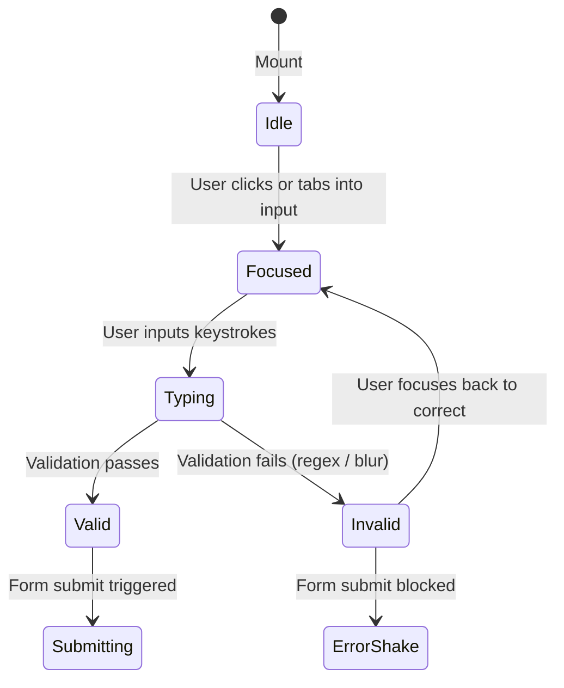
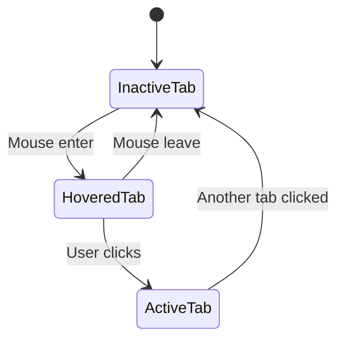
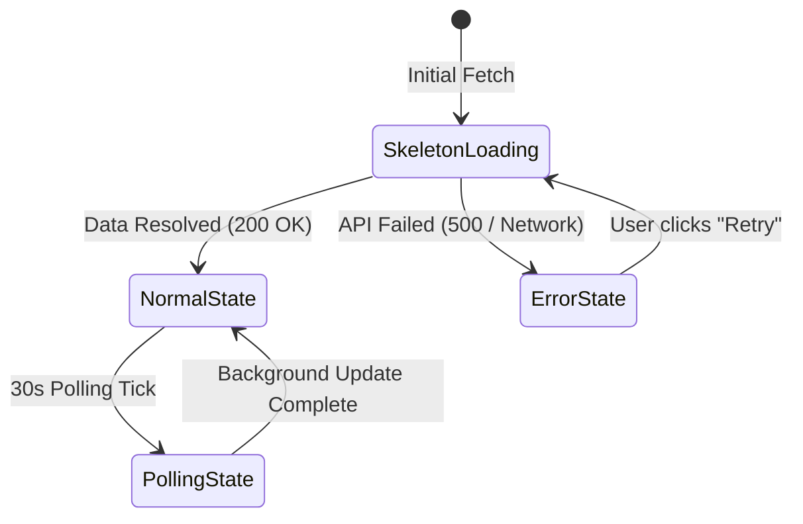

# Interaction Design & UX Experience Specification: SaaSflow

**Document Version:** 1.0.0  
**Design Reference:** Figma File `kQQp6IjO3JC4LjQ6OVIXq9` (File: `User-DashBoard`)  
**UX Designer:** Sally (`🎨`)  

---

## 1. UX Experience Principles

Every interaction in SaaSflow is crafted around three core human-centered design tenets:
1. **Zero Cognitive Friction:** States are immediately visually apparent (inputs show focus rings, buttons show loading spinners, data tables retain position during updates).
2. **Predictable State Transitions:** No jarring layout shifts (CLS < 0.05). Skeletons mirror exact container dimensions.
3. **Graceful Error Recovery:** Errors guide the user directly toward resolution with actionable copy, not cryptic status codes.

---

## 2. Login Screen State Machines & Interactions

### 2.1 Form Field State Matrix

| Input State | Border Color | Background Color | Text Color | Ring / Glow | Icon / Accessory |
| :--- | :--- | :--- | :--- | :--- | :--- |
| **Idle / Pristine** | `#E2E8F0` (`slate-200`) | `#FFFFFF` (`white`) | `#0F172A` | None | Subtle gray icon (`#94A3B8`) |
| **Hover** | `#94A3B8` (`slate-400`) | `#FFFFFF` | `#0F172A` | None | Icon `#475569` |
| **Focused / Active**| `#4F46E5` (`indigo-600`)| `#FFFFFF` | `#0F172A` | `0 0 0 3px rgba(79, 70, 229, 0.15)` | Primary Indigo icon (`#4F46E5`) |
| **Error / Invalid** | `#EF4444` (`red-500`) | `#FFFFFF` | `#0F172A` | `0 0 0 3px rgba(239, 68, 68, 0.15)` | Red alert icon + inline text below |
| **Disabled** | `#E2E8F0` | `#F8FAFC` (`slate-50`) | `#94A3B8` | None | Inactive icon cursor not-allowed |

#### Password Visibility Toggle Interaction
* **Default:** Password masked (`type="password"`), icon is `eye-off` (`#94A3B8`).
* **Hover:** Icon shifts to `#475569`.
* **Click / Press:** Password switches to plaintext (`type="text"`), icon animates to `eye` (`#4F46E5`), focus remains in the password input.

### 2.2 Primary Button ("Sign In") States

| State | Visual Manifestation | Cursor & Behavior |
| :--- | :--- | :--- |
| **Default** | Solid `#4F46E5`, white text "Sign In", `h-11`, `rounded-lg`. | `pointer` |
| **Hover** | Darkens to `#4338CA`, smooth `transition-colors 150ms`. | `pointer` |
| **Active / Pressed** | Scale `0.98`, background `#3730A3`. | `pointer` |
| **Loading / Submitting**| Background `#4F46E5`, text hidden or accompanied by white spinning SVG loader (`animate-spin`), opacity `0.85`. | `wait` (Input fields disabled to prevent race conditions). |
| **Success** | Brief flash to Emerald `#10B981` with checkmark icon before 300ms route transition to `/dashboard`. | `default` |
| **Disabled** | Background `#E2E8F0`, text `#94A3B8`. | `not-allowed` |

### 2.3 Form Error & Toast Notifications
* **Inline Errors:** Rendered directly below the offending input field in `12px` font `#EF4444`, entering with a 150ms slide-and-fade (`translate-y-1` to `translate-y-0`).
* **Global Auth Failure:** (e.g., *"Invalid email or password"* or *"Too many attempts"*):
  * Floats as a top-centered alert banner in the form column.
  * Border: `1px solid #FEE2E2`, Background: `#FEF2F2`, Text: `#991B1B`.
  * Micro-interaction: Form container executes a subtle horizontal shake animation (5px amplitude, 300ms duration).

---

## 3. Dashboard Screen State Machines & Interactions

### 3.1 260px Sidebar Navigation

* **Sidebar Collapse / Mobile Drawer:**
  * **Desktop (>= 1024px):** Fixed `260px` sidebar with `#0F172A` background.
  * **Mobile / Tablet (< 1024px):** Hidden off-canvas (`-translate-x-full`); slides smoothly into view (`translate-x-0`, 250ms ease-out) with a semi-transparent backdrop overlay (`rgba(15, 23, 42, 0.6)`).
* **Nav Items:**
  * **Inactive:** Text `#94A3B8`, Icon `#94A3B8`. Hover background `#1E293B`, text `#FFFFFF`.
  * **Active (`Dashboard`):** Solid `#4F46E5` background, text `#FFFFFF` font-semibold, icon `#FFFFFF`.
* **Workspace Switcher Dropdown:**
  * Clicking `Vortex Workspace` rotates chevron icon 180 degrees (`rotate-180`, 200ms ease).
  * Opens a floating menu beneath (`#1E293B`, border `#334155`, shadow `shadow-xl`) listing accessible workspaces + *"Create new workspace"*.
  * Clicking outside closes the dropdown (click-outside listener).

### 3.2 Global Header & Command Palette (`⌘K`)
* **Search Input:**
  * Pressing `⌘K` (Mac) or `Ctrl+K` (Windows/Linux) or clicking the search box activates the global modal command palette.
  * Search palette blurs background with `backdrop-blur-sm`, opens centered, autofocuses input, and lists quick filters (Users, Actions, Analytics, Settings).
  * `Escape` key dismisses the palette immediately.
* **Notification Bell:**
  * Displays a pulsing red badge dot (`#EF4444`, `8x8px`) when unread alerts exist.
  * Clicking triggers a slide-down popover displaying recent high-priority security notifications (e.g., *"Failed payment attempt detected"*).

### 3.3 4 KPI Cards: Lifecycle & Telemetry States

1. **Initial Load (Skeleton Shimmer):**
   * Card maintains fixed dimensions (`padding: 24px`, `rounded-12px`).
   * Title replaced by `w-24 h-4` pulsing gray bar (`bg-slate-200 animate-pulse`).
   * Value replaced by `w-32 h-8` pulsing gray bar.
   * Icon container shows neutral pulsing square.
2. **Normal State:**
   * Values render with crisp Inter 700 numbers (`$48,250`, `2,847`).
   * Delta pills display appropriate semantic colors:
     * Positive: Emerald `#10B981` on `#D1FAE5` with upward arrow icon.
     * Negative: Rose `#EF4444` on `#FEE2E2` with downward arrow icon.
3. **Polling / Stale-While-Revalidate:**
   * Numbers remain completely stable without layout shift.
   * Subtle micro-indicator (e.g., tiny spinner or opacity shift to `0.9`) signals background sync; transitions in 200ms once fresh data lands.
4. **Error / Network Severed:**
   * Card displays a subtle warning badge (*"Data unavailable"*) with a small inline *"Retry"* button.

### 3.4 Data Visualizations Interaction

#### 1. User Engagement Area Chart
* **Timeframe Switcher Tabs (`7d`, `30d`, `90d`):**
  * Clicking a tab animates an active pill highlight (`#FFFFFF` with `shadow-card`, 200ms spring).
  * Chart data series updates smoothly with a crossfade line transition (300ms ease-out).
* **Hover Data Cursor:**
  * Moving mouse over the chart displays a vertical crosshair line (`#94A3B8`, dashed).
  * Tooltip popover appears in dark slate `#0F172A` with white typography, rendering Date and Exact Session Count.

#### 2. Traffic by Source Donut Chart
* **Slice Hover:**
  * Hovering over a donut segment (Direct, Organic, Referral, Social) increases slice outer radius by `4px` with a subtle elevation glow.
  * Corresponding legend item highlights and non-hovered segments reduce opacity to `0.6`.
  * Tooltip renders channel name, session count, and percentage share.

### 3.5 User Activity Table Interactions

1. **Debounced Search:**
   * User types into search bar; API/client filter executes after 300ms debounce.
   * Table displays inline loading progress bar across top border during filter query.
2. **Status Quick-Filter Menu:**
   * Filter icon opens dropdown: `All Statuses`, `Success`, `Failed`, `Pending`.
   * Selecting a status instantly filters table rows with a subtle fade-in animation (`opacity-0` to `opacity-100`, 150ms).
3. **Pagination State Machine:**
   * **Page 1:** *"Previous"* button is disabled (`opacity-50 cursor-not-allowed`). *"Next"* is active.
   * **Terminal Page:** *"Next"* button is disabled (`opacity-50 cursor-not-allowed`).
   * Clicking *"Next"* triggers smooth page transition (content fades out 100ms, new rows populate and fade in 150ms).
   * Record counter dynamically updates: *"Showing 1 to 4 of 48 entries"*.

---

## 4. Toast Notifications & System Alerts

* **Toast Placement:** Bottom-right viewport anchor (`fixed bottom-6 right-6 z-50`), stacked vertically with `gap-3`.
* **Toast Lifecycle:**
  * Slide in from right (`translate-x-full` to `translate-x-0`, 250ms cubic-bezier).
  * Auto-dismiss after 4000ms unless hovered.
  * Slide out to right on close button click.
* **Toast Variants:**
  * **Success:** Emerald left border, emerald checkmark icon, copy *"Workspace session verified"*.
  * **Error:** Red left border, red alert icon, copy *"Failed to sync latest metrics. Retrying in 10s"*.
  * **Info:** Indigo left border, info icon, copy *"Timeframe updated to 90 Days"*.

---

## 5. Animation Curves & Micro-Interaction Speeds

| Animation Type | Duration | Easing Curve | CSS / Tailwind |
| :--- | :--- | :--- | :--- |
| **Color / Background Transitions**| 150ms | `ease-in-out` | `transition-colors duration-150` |
| **Button Click / Scale** | 100ms | `ease-out` | `active:scale-[0.98] transition-transform duration-100` |
| **Modal / Command Palette** | 200ms | `cubic-bezier(0.16, 1, 0.3, 1)` | `ease-out duration-200` |
| **Sidebar Drawer Slide (Mobile)** | 250ms | `cubic-bezier(0.2, 0, 0, 1)` | `transition-transform duration-250 ease-out` |
| **Chart Data Crossfade** | 300ms | `ease-in-out` | `transition-opacity duration-300` |
| **Error Shake Effect** | 300ms | Keyframe oscillation | `@keyframes shake { 0%, 100% { transform: translateX(0); } 20%, 60% { transform: translateX(-4px); } 40%, 80% { transform: translateX(4px); } }` |
